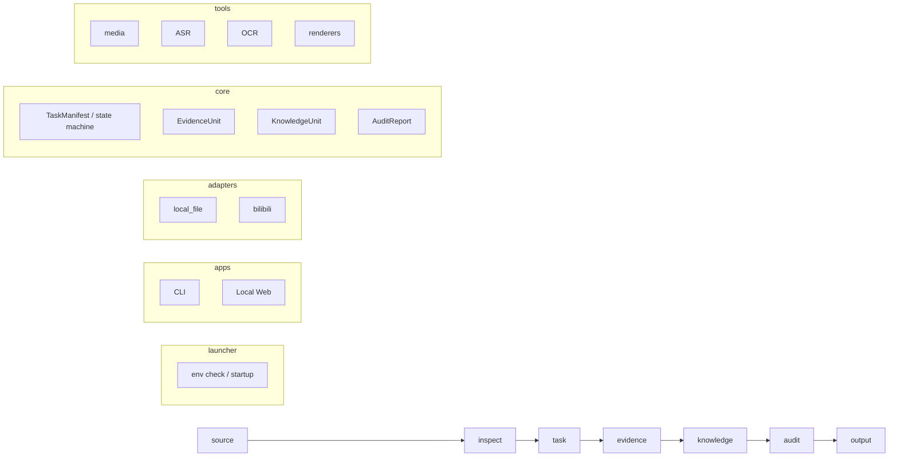

# Video2Skill 架构说明

## 总体图

## 分层职责

### launcher

负责启动、自检、环境准备和入口选择。

### apps

负责对外交互，不承载业务规则。

### adapters

负责把不同来源转换成统一的 `SourceDescriptor`。

### core

负责任务状态、证据结构、知识结构和审计结果。

### tools

负责调用外部能力，但不决定业务策略。

### docs / configs / tests

负责把约束、默认值和验证条件固定下来。

## 依赖规则

- `apps` 可以依赖 `core` 和 `adapters`
- `adapters` 只能依赖契约和基础库
- `core` 不依赖具体来源实现
- `tools` 不直接修改任务状态
- `tests` 只验证契约和行为，不绑死实现细节

## 工作区约定

每个任务应区分三类路径：

- `task_dir`：任务工件
- `cache_dir`：可复用缓存
- `output_dir`：最终输出

不得混用。

